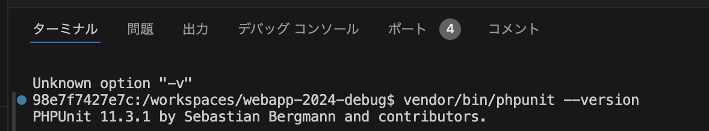
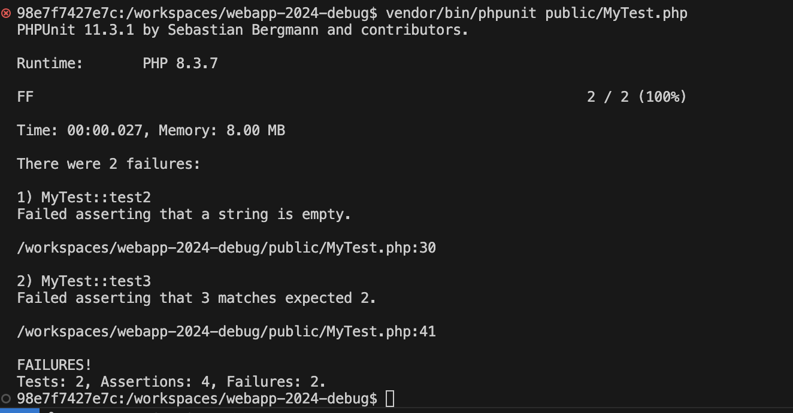

# テストコードを使ったデバッグ

ここからは少し番外編です。
学生時代の開発では、このテストコードを使ったデバッグよりも、手動デバッグやデバッガを使ったデバッグが使いやすいと思います。
しかし、近年の開発では、テストコードを使ったデバッグが重要視されており、テストコードの知見を得ることにはメリットがあります。

## composerを使ったPHPUnitの導入

PHPには、PHPUnitというテストフレームワークがあり、テストコードを書くことができます。

それを導入するために本セミナーではcompoerを使います。
composerは、PHPのパッケージ管理ツールです。
composerを使うことで、PHPのパッケージを簡単にインストールすることができます。

ここでいうパッケージとは、PHPのライブラリやフレームワークのことです。
例えば、LaravelやSymfonyといったフレームワークや、PHPUniteやMonologなど便利なライブラリがあります。

composerを使ってPHPUnitをインストールする手順は以下の通りです。
composerは既にインストールされています。

1. VSCode上で、`Ctrl+Shift+P`(Macの場合は`Cmd+Shift+P`)を押し、コンテナを起動する(既に起動している場合は不要)
2. `Ctrl+J`(Macの場合は`Cmd+J`)を押して、ターミナルを開く
3. `composer require --dev phpunit/phpunit`と入力し、PHPUnitをインストールする
4. `vendor/bin/phpunit --version`と入力し、PHPUnitのバージョンが確認できればインストール成功
   

## テストコードを書いてみる

では実際に、テストコードを書いてみましょう。

`public`ディレクトリ直下に、mytest.phpというファイルがあるので、以下を記述してください。

```php
<?php

// PHPUnitのクラスであるTestCaseを使用するための記述です、本筋とはずれますので今回は解説は省略します
require_once dirname(__FILE__) . '/../vendor/autoload.php';
use PHPUnit\Framework\TestCase;

/**
 * サンプル用テストプログラム
 */
class MyTest extends TestCase
{
    /**
     * 配列の数が期待通りかをテストします。
     */
    public function test1()
    {
        $arr = [100, 200, 300];
        $this->assertCount(3, $arr); // 成功
    }

    /**
     * 値が空であるかをテストします。
     */
    public function test2()
    {
        $value = null;
        $this->assertEmpty($value); // 成功

        $value = 'VALUE';
        $this->assertEmpty($value); // 失敗
    }

    /**
     * 値が期待通りであるかをテストします。
     */
    public function test3()
    {
        $value = 3;

        $this->assertEquals(3, $value); // 成功
        $this->assertEquals(2, $value); // 失敗
    }
}
```

**【解説】**

`Myclass MyTest extends TestCase`:<br>
クラス名は自由につけて構いませんが、`Testcase`を継承することで、テストコードに必要なメソッドが使用できます。

`public function test1()`、`public function test2()`、`public function test3()`:<br>
テストメソッドは、`test`で始まるメソッド名をつける必要があります。

`$this->assertCount(3, $arr);`:<br>
`assertCount`メソッドは、配列の要素数が期待通りかをテストします。

`$this->assertEmpty($value);`:<br>
`assertEmpty`メソッドは、値が空であるかをテストします。

`$this->assertEquals(3, $value);`:<br>
`assertEquals`メソッドは、値が期待通りであるかをテストします。

テストコードを書いたら、以下の手順でテストを実行してみましょう。

1. VSCode上で、`Ctrl+Shift+P`(Macの場合は`Cmd+Shift+P`)を押し、コンテナを起動する(既に起動している場合は不要)
2. `Ctrl+J`(Macの場合は`Cmd+J`)を押して、ターミナルを開く
3. `vendor/bin/phpunit public/mytest.php`と入力し、テストを実行する
4. テストが実行された場合は、以下のように失敗したテスト(Failures)が2と表示される
   

今回は、テストコードのみを書きましたが、実際の開発では、プログラムの動作を確認するためのテストコードを書くことが基本です。
今回は、オブジェクト指向プログラミングのクラスのメソッドが正しく動作するかをテストしてみましょう。

mytest.phpに`test4`メソッドを追加してください。

```php
    /**
     * selectAllメソッドが期待通りの値を返すかをテストします。
     */
    public function test4()
    {
        require_once __DIR__ . '/classes/dbphp.php';
        $dbPhp = new DbPhp();
        $persons = $dbPhp->selectAll();
        $this->assertCount(6, $persons); // 成功
    }
```

このテストメソッドは、`selectAll`メソッドが期待通りの値を返すかをテストしています。
ここでいう期待通りの値とは、`selectAll`メソッドが返す配列の要素数が6であることを期待しています。

テストコードを書いたら、`vendor/bin/phpunit --filter test4 public/mytest.php`と入力して、テストを実行してみましょう。
テストが成功した場合は、テスト結果の「Assersions」という数が増え、「Failures」の数は変わらずで表示されます。

このように、テストコードを書くことで、プログラムの動作を確認することができます。
では、実際の開発現場ではなぜテストコードを書く必要があるのでしょうか？

それは、第3者にプログラムが正しく動作することを証明するためです。
第3者とは、お客様だけではありません。
プロジェクトが正しく運用されるためには、上司やチームメンバーに対しても、プログラムが正しく動作することを客観的に保証する必要があります。

そのための手段として、テストコードが重宝されているのです。
(※私が現役の時は、すべて手動でプログラムを動かし、エクセルとスクショで管理していました...とほほ...)

ちなみに、このテストコードというのは、入力に対する出力が期待通りかを機械的に確認するときに力を発揮します。
つまり、上記例のようなオブジェクト指向プログラミングのように、ロジックの部分をクラスのメソッドとして切り出している場合に非常に有効な手段なのです。

こういった意味でもオブジェクト指向プログラミングは、プログラムの保守性を高めるために非常に有効な手段です。