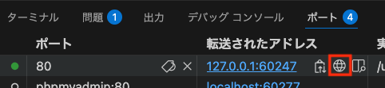

# 手動デバッグ

手動デバッグは、プログラムの動作を確認しながらバグの原因を探すため、バグの原因を見つけるまでに時間がかかることがあります。
しかし、手動デバッグは、バグの原因を探すための基本的なスキルを身につけるためには最適な方法です。

「[Webアプリケーション開発](https://2025web1.github.io/05-http-get/var_dump.html)」の授業でも紹介しましたが、手動デバッグを実施する上では、`var_dump`を使うことが多いです。
`var_dump`は、変数、配列、オブジェクトの中身を確認するための関数です。

特に、配列やオブジェクトなど、複雑なデータ構造を扱う場合には、`var_dump`を使うことで、データ構造を理解しやすくなります。
以下は、そういった複雑なデータ構造を扱う場合の`var_dump`の使い方で、`$array`という配列を`var_dump`で出力する例です。

`pulic`ディレクトリ直下の、`var_dump.php`に以下のコードを記述してください。

**var_dump.php**

```php
<?php
$array = [
    'key1' => 'value1',
    'key2' => 'value2',
    'key3' => [
        'key4' => 'value4',
        'key5' => 'value5',
    ],
];

var_dump($array);
```

上記のコードをブラウザで確認しましょう。
久しぶりなのでブラウザの確認方法のおさらいです。

1. VSCode上で、`Ctrl+Shift+P`(Macの場合は`Cmd+Shift+P`)を押し、コンテナを起動する
2. VSCode上で、`Ctrl+J`(Macの場合は`Cmd+J`)を押し、ターミナルを表示する
3. 画面下部のポートをクリックし、地球儀マークをクリックする<br>
   
4. ブラウザが表示されるので「var_dump.php」のリンクをクリックし、以下のような表示がされればOK

```php
/var/www/html/var_dump.php:11:
array (size=3)
  'key1' => string 'value1' (length=6)
  'key2' => string 'value2' (length=6)
  'key3' => 
    array (size=2)
      'key4' => string 'value4' (length=6)
      'key5' => string 'value5' (length=6)
```

`var_dump`の出力結果は、以下のような情報を提供しています。

- `array(size=3)`：配列の要素数が3つであることを示しています
- `'key1' => string 'value1' (length=6)`：`key1`というキーに`value1`という値が入っていることを示しています

`var_dump`の出力結果を見ることで、配列やオブジェクトの中身を理解しやすくなります。
これにより、デバッグの際に、バグの原因を見つけやすくなります。