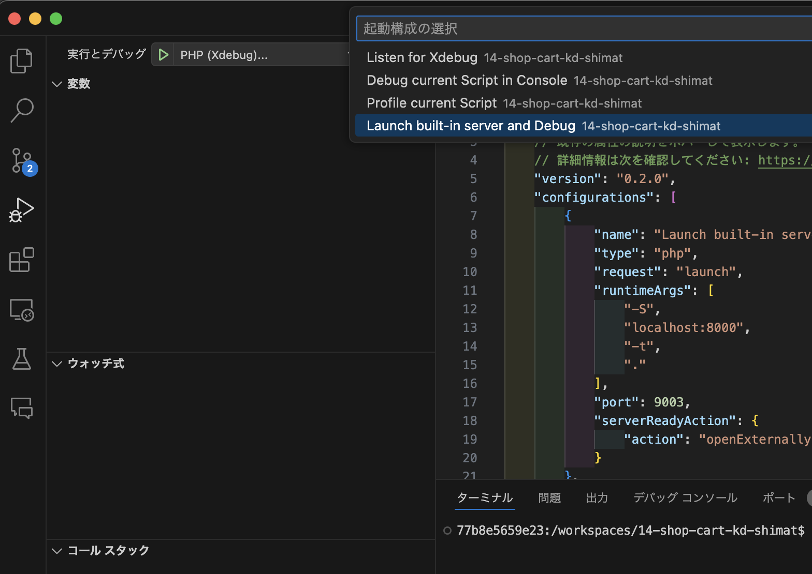
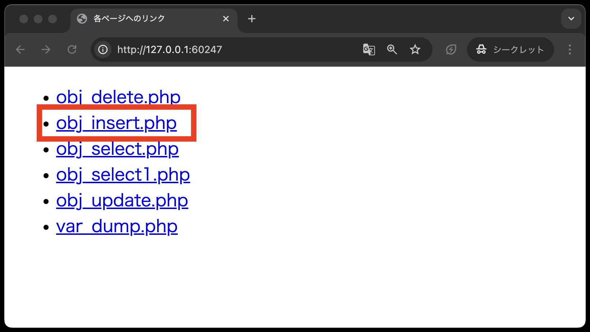

# デバッガを使ったデバッグ

`var_dump`を使って手動デバッグを行うこともできますが、コードが複雑になると、バグの原因を見つけるのに時間がかかるとともに、一時的ではありますが、ソースコードを修正する必要があります。
そこで、**デバッガ**を使ったデバッグが有効です。

デバッガを使ったデバッグとは、デバッガというツールを使い、プログラムの動作を一時停止させながら、処理の流れを追うことでバグの原因を探す方法です。
PHPには、デバッガとして**Xdebug**というツールがあります。
まずは、そのツールの使い方を学びましょう。

Xdebugを使うようにするには以下の手順を踏む必要があります。

1. VSCode上で、`Ctrl+Shift+P`(Macの場合は`Cmd+Shift+P`)を押し、コンテナを起動する(既に起動している場合は不要)
2. 左バーの虫と三角のアイコンを押して、「launch.jsonファイルを作成します」をクリックする(クリック後、選択するリストが表示される場合があり、その場合は「PHP」をクリック)
   
3. 以下のように画面が変わる
    
4. 上部の「実行とデバッグ」というプルダウンリストからPHP(Xdebug)を選択する
   
5. 「Launch built-in server and Debug」を選ぶ
    
6. 実行とデバッグの横の緑三角をクリック
   
7. ブラウザが立ち上がり、デバッガが起動する<br>
   以下のようにブラウザが立ち上がり、http://localhost:8000/ にアクセスされます
    <br>
   
```tip
   **【補足】** もしブラウザが立ちがらなかったら、`.vscode/launch.json`で`"name": "Launch built-in server and Debug"`の下部に記載されている`"."`を、`"public"`に変更してください。
   
```

これで、デバッガの準備が整いました。
では、実際にデバッガを使ってみましょう。

## デバッガを使ったデバッグで使用するコードについて

今回は、以前「Webアプリケーション開発」授業で扱った、[オブジェクト指向プログラミング](https://2025web1.github.io/08-object/)のコードをデバッグします。

コードの仕様について軽くおさらいしておきましょう。
まず、以下のような構造と初期データが入っているpersonテーブルがあります。

**テーブル構造**

* `uid`: int型、主キーとして設定、 auto_increment付き
* `name`: varchar型、最大文字数20
* `company_id`: int型
* `age`: int型

**初期データ**
※`uid`は自動採番(auto_increment)されるため省略しています。

|  name |company_id|age|
|-------|---------:|--:|
|財津一郎|          1| 5|
|田宮二郎|          2|15|
|北島三郎|          3|25|
|伊東四朗|          3|35|
|糸井五郎|          1|45|
|鶴田六郎|          2|55|

実際にphpMyAdminでデータベースを確認してみましょう。

1. 画面下部のポートをクリックし、phpMyAdminと書かれてあるところの地球儀マークをクリックする
   
2. phpMyAdminが立ち上がるので、左側のデータベース一覧から`SAMPLE`をクリックする
   
3. `person`をクリックする
   
4. 以下のようにデータが表示されればOK
   

このテーブルに対して、PHPから`SELECT`文や`INSERT`文の操作できる仕様となっています。
また、コードの記述についてはオブジェクト指向プログラミングに則り、データベース操作をクラスに切り分けています。

コードの中身については記述済みですが、**デバッグのために、わざとバグを仕込んでいるコードがあります。**

## デバッガの基本的な操作

まずは、バグを見つける前に、デバッガの基本的な操作を学びましょう。

### ◆ブレークポイントの設定

デバッガを使ってプログラムをデバッグする際には、ブレークポイントを設定します。
ブレークポイントとは、プログラムの実行を一時停止させるためのポイントのことです。
ブレークポイントを設定するには、以下の手順を行います。

1. ブレークポイントを設定したい行にカーソルを合わせる
   今回は、`public/classes/dbphp.php`の`selectAll`メソッドの`return $persons`(18行目)にブレークポイントを設定します。
    
2. 18行目にカーソルを合わせ、`F9`キーを押すとブレークポイントが設定される、すると行番号の左側に丸(赤い丸のときもある)が表示される
   

3. ブレークポイントが設定されたら、ブラウザに戻り、「obj_select.php」のリンクをクリックする
   

4. ブレークポイントが設定された行でプログラムが一時停止される
   

5. デバッガの左側のバーで、 `selectAll`メソッドでのブレークポイントより前の行までの変数の値を確認できる
   

このように、ブレークポイントを設定することで、プログラムの実行を一時停止し、変数の値を確認することができます。
つまり、ブレークポイントを使うことで、ソースコードを修正することなく、`var_dump`と同等、もしくはそれ以上の情報を得ることができます。

更に、デバッガには、以下のような操作を使い、より効率的にデバッグ作業を行うことができます。

- `F11`：ステップイン（関数内に入る）
- `F10`：ステップオーバー（関数内に入らずに次の行に進む）
- `Shift+F11`：ステップアウト（関数から出る）
- `F5`：続行(次のブレークポイントまで実行、ブレークポイントがない場合は、プログラムが終了するまで実行)

また、コマンド以外にも、VSCode上の以下のコントロールパネルでも同様の操作ができます。<br>


では、次に進む前に、ブレークポイントの削除と、デバッガの停止をしておきましょう。

1. ブレークポイントを削除する<br>
   `public/classes/dbphp.php`の`selectAll`メソッドの`return $persons`(18行目)のブレークポイントを`F9`キーで削除してください。
   左側の丸が消えれば削除されています。

2. デバッガを停止する<br>
   コントロールパネルの停止(もしくは`Shift+F5`キー)ボタンを押して、デバッガを停止してください。

## ブレークポイントの設定場所の例

具体的に、バグを見つけるためにブレークポイントを設定する場所について例を紹介します。
今回は、`obj_insert.php`を実行した際に、システムエラーが発生するバグを見つけるために、ブレークポイントを設定してみましょう。

1. VSCodeの下部にあるポートタブをクリックし、`80`ポートの地球儀マークをクリックする<br>
   

2. ブラウザに戻り、`obj_insert.php`のリンクをクリックする<br>
   

3. システムエラーが発生する<br>
   以下のように、システムエラーが発生します。
   

4. ブレークポイントを設定する場所を考える<br>
   システムエラーの内容を確認すると、`DbPhp`クラスの`exec`メソッドの39行目でエラーが発生していることがわかります。
   ここで気をつけなければならないのは、**エラーが発生している箇所にブレークポイントを設定しても、プログラムは一時停止されないことです。**
   つまり、エラーが発生している箇所より、前の行にブレークポイントを設定する必要があります。

   今回は、ブレークポイント以外の、デバッガの機能も使いながらデバッグしたいので、`public/classes/obj_insert.php`の`$dbPhp = new DbPhp();`(14行目)にブレークポイントを設定します。
    

5. ブレークポイントが設定されたら、ブラウザに戻り、`obj_insert.php`のリンクをクリックする<br>
    

6. ブレークポイントが設定された行でプログラムが一時停止される<br>
   

7. コントロールパネルを使って、システムエラーが発生した箇所まで進む<br>
   まずは、ステップオーバー(`F10`)キーを使って、次の行に進みます。
   

8.  ステップイン(`F11`)を使って、`insertPerson`メソッドに入る<br>
   以下のように、`insertPerson`メソッドに入ることができます。
   左側のバーメソッドの引数の値が確認できます。
   

9.  ステップオーバー(`F10`)を使って、40行目に進む<br>
   左側のバーに、`$sql`の変数の値が表示されているのがわかります。
   このメソッド内では、あくまで変数を定義しただけなので、エラーは発生していません。
   

10. ステップイン(`F11`)を使って、`exec`メソッドに入る<br>
    以下のように、`exec`メソッドに入ることができます。
    

11. おおよそのエラーのあたりをつける<br>
    先ほどの例外発生した箇所は、`exec`メソッドの中で、`$stmt->execute();`の行でした。
    デバッガを使って、ここまでのプログラムの流れを確認してきましたが、基本的には、`insertPerson`メソッド、`exec`メソッドに引数を渡している処理が続いていました。

    `stmt->execute();`はSQLを実行する処理です。
    つまり、今まで渡ってきた引数を使って形成されるSQLに何らかの構文エラーが起こっていることが考えられます。
    改めて、左のバーで変数の値を確認してみましょう。
    

     `$sql`の値を確認すると、以下のようになっています。

     ```sql
      insert into person ( nama, company_id, age ) values ( ?, ?, ? )
      ```

    よくよく確認すると、personテーブルのカラム名が`nama`になっています。
    正しくは、`name`です。
    このため、SQLの構文エラーが発生していたと考えられます。
    dbphp.phpのinsertPersonメソッドのSQL文を修正すれば正しく動作するはずです。
    このように、デバッガを使って、処理の流れを追いながらエラーの原因箇所を特定することができます。

## 【補足】ブレークポイントの設定箇所について

今回のセミナーではデバッガの操作方法を説明しましたが、ブレークポイントを設定する箇所については、ある程度経験が必要です。
ただし、今回は経験がなくてもブレークポイントの設定箇所についておおよそのあたりをつける方法を紹介します。
以下の2つを守ってください。

1. エラーが出た箇所より前の行にブレークポイントを設定する<br>
   これは単純にエラーがでた箇所より後ろの行にブレークポイントを設定しても、ブレークポイントで止まらないからです

2. エラー文にあるスタックトレースを見る<br>
   エラー文には、エラーが発生した箇所のファイル名と行番号が表示されます。
   この情報を元に、エラーが発生した箇所のファイルを開き、ブレークポイントを設定します。<br><br>
   例えば、以下のエラー文が表示された場合、どこにブレークポイントを設定すればいいか考えてみましょう。<br>
   <br><br>
   
   上記画像のエラー文を全て以下に記載します。
      ```php
      Fatal error: Uncaught PDOException: SQLSTATE[42S22]: Column not found: 1054 Unknown column 'nama' in 'field list' in /workspaces/webapp-2024-debug/public/classes/dbdata.php:41
      Stack trace:
      #0 /workspaces/webapp-2024-debug/public/classes/dbdata.php(41): PDOStatement->execute(Array)
      #1 /workspaces/webapp-2024-debug/public/classes/dbphp.php(40): DbData->exec('insert into per...', Array)
      #2 /workspaces/webapp-2024-debug/public/obj_insert.php(15): DbPhp->insertPerson('名前', 3, 29)
      #3 {main}
      thrown
      ```

   このエラー文のスタックトレースは以下の通りです。
   1. `DbData->exec('insert into per...', Array)`：`DbData`クラスの`exec`メソッドの41行目でエラーが発生している
   2. `DbPhp->insertPerson('名前', 3, 29)`：`DbPhp`クラスの`insertPerson`メソッドの40行目でエラーが発生している
   3. `obj_insert.php`：`obj_insert.php`の15行目でエラーが発生している

   つまり、ブレークポイントを設定する箇所は、このスタックトレースの直前となるので、以下のようになります。
   - `DbData`クラスの`exec`メソッドの41行目
   - `DbPhp`クラスの`insertPerson`メソッドの40行目
   - `obj_insert.php`の15行目